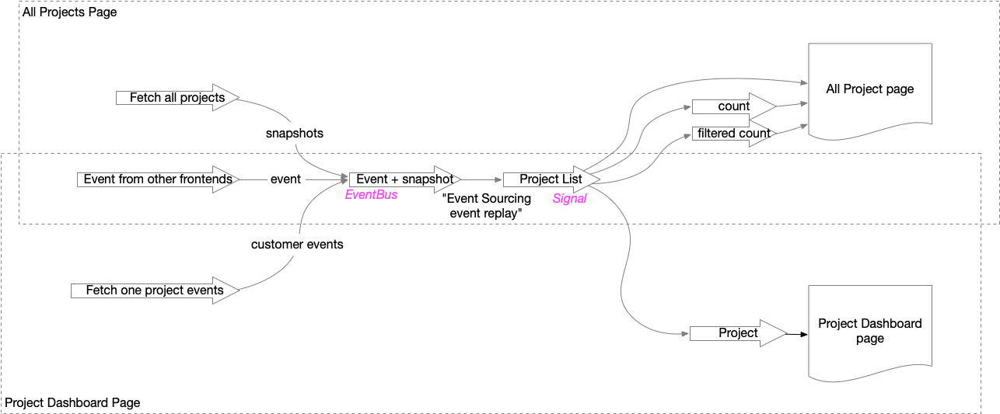

# Web frontend part: using Laminar

Small Single Page example application using [Scala.js](http://www.scala-js.org/) and [Laminar](https://laminar.dev/). This client app connect to an [Kalix](https://kalix.io) backend [funding](../funding). It manages crowd funding projects (update project details, invest money in project).

We show here an event driven approach for client application:  Event Sourcing, Event Stream (Laminar), push event through web socket to maintain client  up to date with backend.

The project is based on Yurique example: https://github.com/yurique/scala-js-laminar-starter.g8

# Purpose

Laminar is the perfect tool to define Event Sourcing at client side. We use an event stream of events piped to a Signal of list of projects which is the base for the display. A project has:

- Project ID
- Title
- Description
- Goal: The amount of money you want to achieve with your crowd funding project
- Funded: The amount of money collected so far

The event stream is supplied with events from 3 possible sources:

- All projects fetched from Kalix application using REST call (This is done when we display the "All projects" page displaying all projects) Url: http://localhost:3000/projects
- All events of one particular project fetched from Kalix application using REST call  (this is done when we display a project dashboard page) Url: http://localhost:3000/project/1
- Event from any change made in another client (this other client send the event to Laminar backend which is then broadcasted to all SPA instances using web socket)

As a summary, this below diagram show the event / data flow of this application :



Once all these streams are connected, everything is updated automatically ! Great !

No cache to manage, it's all done by Laminar. After serverless, welcome to clientless !


# Shared part with Kalix project

## Create unix links

You shouldn't have to do that because when you get it from Github, links are preserved.

```
cd funding-fe/modules/proto/src/main/protobuf/com/funding/entity
ln -s ../../../../../../../../../funding/src/main/protobuf/com/funding/entity/project_entity.proto . 
cd ../../../../../../../../../funding-fe/modules/proto/src/main/protobuf/com/funding/api
ln -s ../../../../../../../../../funding/src/main/protobuf/com/funding/api/project_api_shared.proto . 
cd ../../../../../../../../../funding-fe/modules/proto/src/main/protobuf/com/funding/view
ln -s ../../../../../../../../../funding/src/main/protobuf/com/funding/view/project_details_view_shared.proto .
```


# Setup npm dependencies

Install npm dependencies:

```
npm install
```

# Running the app

## Front-end

1. npm 

   ```
   npm start
   ```

2. In another terminal, run this (it make sbt re-compile the front-end on code changes)

   ```
   sbt ~frontend/fastLinkJS
   ```

3. run frontend server 

   ```
   sbt ~backend/reStart
   ```

4. If you run the Kalix app locally, you to run Chrome by disabling CORS check 

   ```
   open -n -a /Applications/Google\ Chrome.app/Contents/MacOS/Google\ Chrome --args --user-data-dir="/tmp/chrome_dev_test" --disable-web-security
   ```

   

## Open in browser

### See all projects

http://localhost:3000/projects

### Inspect one project dashboard

Url for project #1:

http://localhost:3000/project/1

